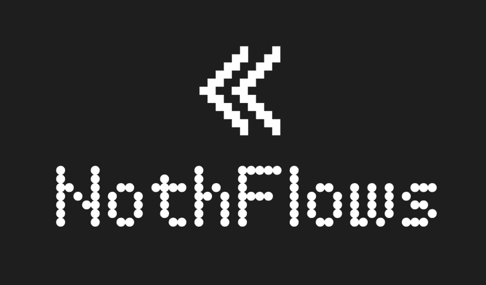

# NothFlows

NothFlows upgrades Sleep, Focus and Custom modes into smart, on‑device automations that run entirely on your Nothing Phone.



It extends familiar features like Do Not Disturb into full automation flows you set up just by saying what you want, instead of tapping through settings.

For example: “When I switch to Sleep flow, clean screenshots older than 30 days and lower brightness to 20%.”

Most Nothing users today are tech enthusiasts, so NothFlows doubles as a playful “mini n8n” for power users while also making automation accessible to non‑technical users who just want to describe what they need in plain language.

The app runs a local Qwen3 600M model via the Cactus SDK to parse your instructions into executable automation tasks—100% offline.


### Key Features

- **Three Core Modes**: Sleep, Focus, and Custom
- **Natural Language Flows**: Add automations by describing what you want
- **100% On-Device AI**: All inference happens locally using CactusLLM
- **NothingOS Aesthetic**: Glassmorphic UI optimised for Nothing Phones
- **Local Storage**: All data persists on-device

## Project Structure

```
lib/
├── main.dart                       # App entry point with splash screen
├── models/
│   ├── flow_dsl.dart              # DSL schema and validation
│   └── mode_model.dart            # Mode data model
├── services/
│   ├── cactus_llm_service.dart   # Qwen3 LLM integration
│   ├── storage_service.dart       # Local persistence layer
│   └── automation_executor.dart   # Flow execution engine
├── screens/
│   ├── home_screen.dart           # Main screen with mode cards
│   ├── mode_detail_screen.dart   # Flow management for a mode
│   ├── flow_preview_sheet.dart   # Flow preview bottom sheet
│   └── results_sheet.dart         # Execution results display
└── widgets/
    ├── glass_panel.dart           # Glassmorphic container
    ├── mode_card.dart             # Mode display card
    └── flow_tile.dart             # Flow list item
```

## DSL Schema

The app uses a simple JSON-based DSL for automation flows:

```json
{
  "trigger": "mode.on:sleep",
  "actions": [
    { "type": "clean_screenshots", "older_than_days": 30 },
    { "type": "lower_brightness", "to": 20 }
  ]
}
```

### Supported Actions

| Action Type | Parameters | Description |
|------------|------------|-------------|
| `clean_screenshots` | `older_than_days` | Delete old screenshots |
| `clean_downloads` | `older_than_days` | Delete old downloads |
| `mute_apps` | `apps` (array) | Mute app notifications |
| `lower_brightness` | `to` (0-100) | Set screen brightness |
| `set_volume` | `level` (0-100) | Set system volume |
| `enable_dnd` | - | Enable Do Not Disturb |
| `disable_wifi` | - | Disable Wi-Fi |
| `disable_bluetooth` | - | Disable Bluetooth |
| `set_wallpaper` | `path` | Change wallpaper |
| `launch_app` | `app` | Launch an application |

## Cactus SDK Integration

### Model Configuration

- **Model**: Qwen3 600M
- **Quantisation**: Q4_0 (optimised for mobile)
- **Context Length**: 2048 tokens
- **Mode**: Local-only (no cloud fallback)
- **Threads**: 4 (optimised for Nothing Phone hardware)

### Usage

```dart
final llmService = CactusLLMService();

// Initialise the model
await llmService.initialise();

// Parse natural language instruction
final flow = await llmService.parseInstruction(
  instruction: 'Clean screenshots older than 30 days and lower brightness',
  mode: 'sleep',
);
```

### System Prompt

The service uses a carefully crafted system prompt that enforces strict JSON output:

- Forces the model to output only valid DSL JSON
- Provides examples of correct format
- Lists all valid action types and parameters
- Returns empty actions array for unclear instructions

## Setup Instructions

### 1. Install Dependencies

```bash
flutter pub get
```

### 2. Configure Cactus SDK

Add the Cactus SDK model files to your project:

```bash
# The Qwen3 600M model will be downloaded on first run
# and cached in the app's files directory
```

### 3. Permissions

The app requires the following Android permissions:

- `MANAGE_EXTERNAL_STORAGE` - For cleaning files
- `WRITE_SETTINGS` - For brightness control
- `INTERNET` - For model downloads (first run only)

These are declared in `android/app/src/main/AndroidManifest.xml`.

### 4. Build and Run

```bash
# Debug build
flutter run

# Release build (recommended for performance)
flutter build apk --release
```

## Architecture Decisions

### 1. Local-First AI

All AI inference happens on-device using CactusLLM. This ensures:
- **Privacy**: No data leaves the device
- **Performance**: No network latency
- **Reliability**: Works offline

### 2. DSL-Based Flows

Using a JSON DSL provides:
- **Validation**: Type-safe action definitions
- **Extensibility**: Easy to add new actions
- **Debugging**: Human-readable format

### 3. Glassmorphic UI

The NothingOS-inspired design features:
- **Glass panels** with backdrop blur
- **Minimal colours** with accent highlights
- **High contrast** for OLED displays
- **Large touch targets** for usability

### 4. Service Layer Pattern

Services are singletons for:
- **Consistency**: Single source of truth
- **Performance**: Model loaded once
- **State management**: Shared storage instance

## Example Flows

### Sleep Mode

```
"Clean screenshots older than 30 days"
→ { type: "clean_screenshots", older_than_days: 30 }

"Lower brightness to 20%"
→ { type: "lower_brightness", to: 20 }

"Enable Do Not Disturb"
→ { type: "enable_dnd" }
```

### Focus Mode

```
"Mute Instagram, TikTok, and Twitter"
→ { type: "mute_apps", apps: ["Instagram", "TikTok", "Twitter"] }

"Launch Notion"
→ { type: "launch_app", app: "Notion" }
```

## Future Enhancements

### Phase 2: SmolVLM Integration

- Visual flow creation using screenshots
- OCR for app name extraction
- Context-aware suggestions

### Phase 3: Advanced Automations

- Time-based triggers
- Location-based triggers
- Conditional logic (if/then)
- Flow chaining

### Phase 4: Community Features

- Share flows with others
- Flow marketplace
- Template library

## Development Notes

### Adding New Actions

1. Add action type to `FlowDSL.isValid()` in `lib/models/flow_dsl.dart:44`
2. Implement execution in `AutomationExecutor._executeAction()` in `lib/services/automation_executor.dart:51`
3. Add description logic to `FlowDSL.getDescription()` in `lib/models/flow_dsl.dart:83`
4. Update system prompt in `CactusLLMService` with new action type

### Testing the LLM

Use the warm-up function to test model initialisation:

```dart
await CactusLLMService().warmUp();
```

### Debugging Flows

The `FlowDSL` class includes a `getDescription()` method for human-readable output:

```dart
print(flow.getDescription());
// Output:
// When sleep mode is activated:
//   • Clean screenshots older than 30 days
//   • Set brightness to 20%
```

## Performance Optimisations

1. **Model Caching**: Qwen3 model cached after first download
2. **Lazy Loading**: LLM initialised on first use, not at startup
3. **Low Temperature**: Set to 0.3 for consistent JSON output
4. **Quantisation**: Q4_0 reduces model size by ~75%
5. **Thread Pool**: 4 threads for optimal inference speed

## Known Limitations

1. **First Run**: Initial model download requires internet (~500MB)
2. **Parsing Accuracy**: Complex instructions may need rephrasing
3. **System Permissions**: Some actions require elevated Android permissions
4. **Android 10+**: Wi-Fi/Bluetooth toggle requires user interaction

## Licence

MIT

## Support

For issues or questions, please open an issue on GitHub.

---

Built with ❤️ for Nothing Phone users
